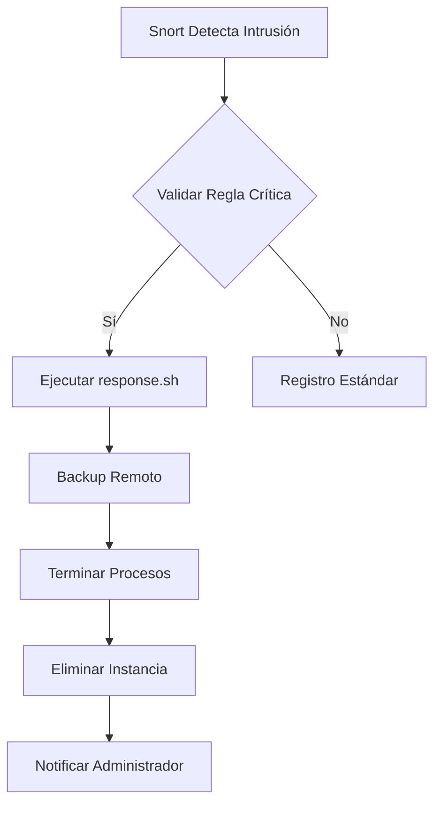

---

# **Sistema de Detección y Respuesta Automatizada con Snort**

## **Requisitos Previos**
1. Snort 3.x instalado y configurado
2. Permisos de superusuario (`root`)
3. Espacio en disco externo/remoto para backups
4. Entorno de pruebas aislado (recomendado)

---

## **1. Configuración de Snort**

### **1.1 Reglas Personalizadas**
Agregar reglas en `/etc/snort/rules/local.rules`:
```bash
alert tcp any any -> any any (
    msg:"ALERTA DE INTRUSION CRITICA"; 
    sid:1000001; 
    rev:1; 
    metadata:policy max-detect-ips drop; 
    classtype:attempted-admin;
    threshold: type threshold, track by_src, count 1, seconds 60;
)
```

### **1.2 Habilitar Salidas Accionables**
En `/etc/snort/snort.lua`:
```lua
alert_fast = {
    file = true,
    packet = false,
    limit = 10
}

alert_syslog = {
    level = 'emerg'
}
```

---

## **2. Script de Respuesta Automatizada (`/usr/local/bin/response.sh`)**
```bash
#!/bin/bash

# Registro de eventos
LOGFILE="/var/log/intrusion_response.log"

# Función de preservación de datos
backup_data() {
    TIMESTAMP=$(date +%Y%m%d-%H%M%S)
    BACKUP_DIR="/mnt/secure_backup/$TIMESTAMP"
    
    mkdir -p $BACKUP_DIR
    cp -r /var/log /etc $BACKUP_DIR
    rsync -azh $BACKUP_DIR backupserver.example.com:/secure_storage/
    
    echo "$(date) - Backup realizado en $BACKUP_DIR" >> $LOGFILE
}

# Función de contención
system_lockdown() {
    # 1. Preservar datos
    backup_data
    
    # 2. Detener procesos (modo seguro)
    killall5 -15 # Señal SIGTERM a todos los procesos
    
    # 3. Eliminar instancia (para entornos cloud)
    # AWS/Azure/GCP CLI commands aquí
    
    # 4. Autodestrucción física (para hardware especializado)
    # echo 1 > /sys/class/hw/destruct_device
    
    # 5. Apagado forzoso
    poweroff -f
}

system_lockdown >> $LOGFILE 2>&1
```

---

## **3. Integración con Snort**
Crear hook en `/etc/snort/alerts`:
```bash
#!/bin/bash
while read ALERT; do
    if grep -q "ALERTA DE INTRUSION CRITICA" <<< "$ALERT"; then
        /usr/local/bin/response.sh &
        exit 0
    fi
done
```

---

## **4. Hardening de Seguridad**
```bash
chmod 700 /usr/local/bin/response.sh
chown root:root /usr/local/bin/response.sh
sudo setcap cap_sys_admin+ep /usr/local/bin/response.sh
```

---

## **5. Protocolo de Recuperación**
1. Recuperar backups desde el servidor remoto
2. Validar integridad con checksums SHA-256
3. Reinstanciar sistema desde plantilla limpia
4. Restaurar datos críticos manualmente

---

## **Consideraciones Críticas**

1. **Pruebas**: 
   - Simular intrusiones con `snort -T` y herramientas como `nikto`
   - Validar tiempos de respuesta en entorno controlado

2. **Falsos Positivos**:
   - Implementar período de cuarentena antes de la autodestrucción
   - Usar múltiples reglas de correlación

3. **Alternativas para Hardware Físico**:
   ```bash
   # En lugar de destrucción física
   hdparm --security-erase-enhanced /dev/sda
   cryptsetup luksErase /dev/sdb1
   ```

4. **Monitorización Remota**:
   - Configurar alertas SNMP trap a sistema central
   - Habilitar consola out-of-band (iDRAC/iLO)

---

## **Diagrama de Flujo**



---

**Nota Legal**: Este sistema debe implementarse solo en entornos autorizados y con protocolos de verificación múltiple. La autodestrucción de sistemas podría violar políticas de seguridad organizacionales y regulaciones locales.